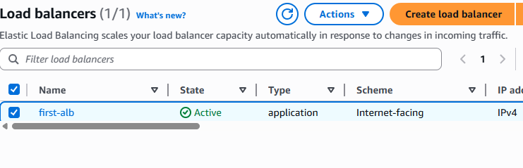
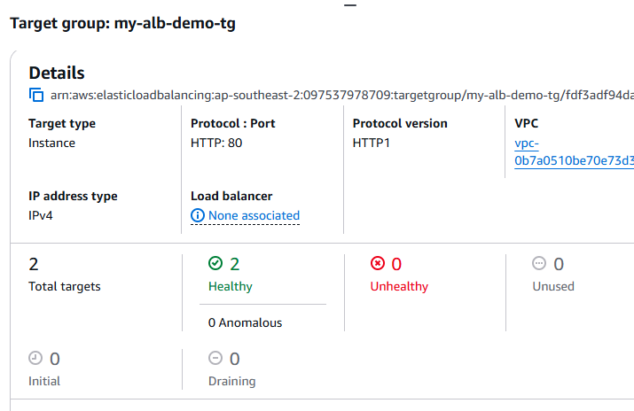

# AWS Load Balancer Project

  
*Replace this with an actual screenshot of your AWS Load Balancer architecture or console.*

## Table of Contents
- [Project Overview](#project-overview)  
- [Architecture Diagram](#architecture-diagram)  
- [Prerequisites](#prerequisites)  
 

---

## Project Overview
This project demonstrates the deployment of an **AWS Load Balancer** to distribute traffic across multiple EC2 instances. It uses **Terraform** scripts and/or AWS CLI to provision infrastructure programmatically.  

**Key objectives:**  
- Deploy an **Elastic Load Balancer (ELB)**.  
- Attach **EC2 instances** to the load balancer.  
- Monitor traffic and health of instances.  
- Provide a scalable and fault-tolerant setup.

---

## Architecture Diagram
  
 
 
 

**Description:**  
1. **Elastic Load Balancer (ELB)** distributes HTTP/HTTPS traffic.  
2. **EC2 Instances** handle application requests.  
3. **Security Groups** control access to the instances and ELB.  
4. Optional: **Auto Scaling Groups** for automatic scaling.

---

## Prerequisites
Before setting up the project, ensure you have the following:  

- AWS account with proper permissions  
- AWS CLI configured (`aws configure`)  
  

```bash
#!/bin/bash
# User data for new EC2 instances
# install httpd (Linux 2 version)
yum update -y
yum install -y httpd
systemctl start httpd
systemctl enable httpd
echo "<h1>Hello World! This is $(hostname -f)</h1>" > /var/www/html/index.html
